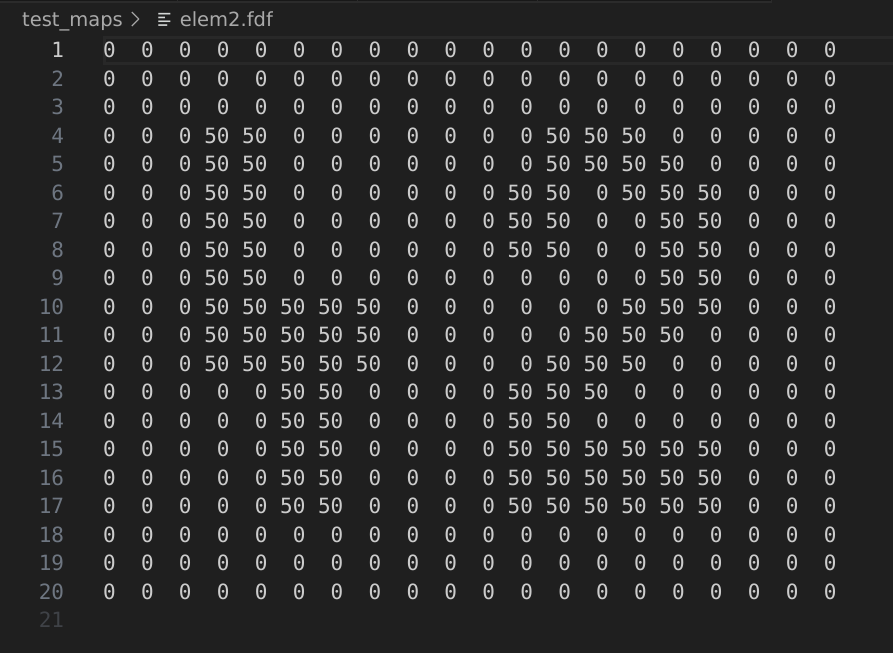
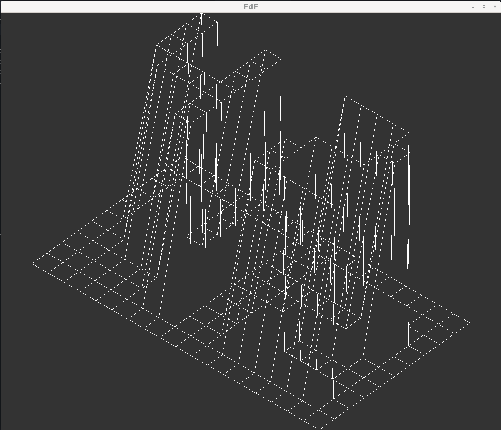
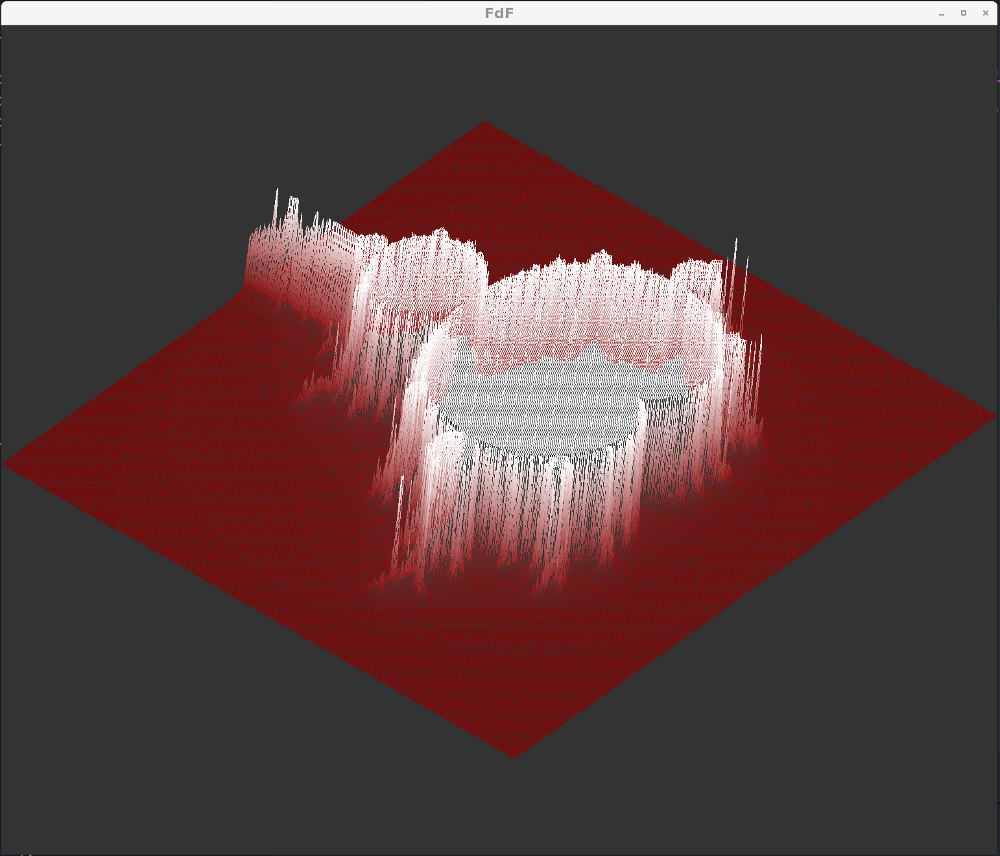

# FdF

This project is about implementing a wireframe model using [MLX42](https://github.com/codam-coding-college/MLX42), Codam's own mini graphics library. 

The program receives as input a text file with extension .fdf that represents points in a 3D space. An example of such an input:

<figure>
	
	<figcaption>Example of an .fdf file</figcaption>
</figure>

To run, make the project with ``` make ``` and run  ``` ./fdf <file-path> ```

Examples of rendered maps are:


<figure>
	
	<figcaption>Rendering of previous map (42.fdf)</figcaption>
</figure>

<figure>
	
	<figcaption>From elem-fract.fdf</figcaption>
</figure>
